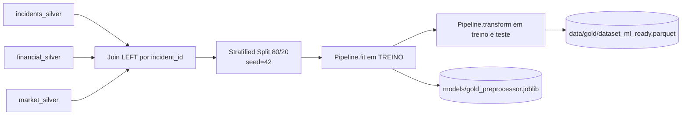

# Plano Técnico — Pessoa 2: Camada Gold + Pré-processamento ML-Ready

> **Objetivo:** transformar os 3 datasets da Silver em um único dataset ML-ready,
> com pipeline de transformações reprodutível, sem data leakage, salvo em Parquet.

---

## 1. Estado atual (Silver) — ponto de partida

Disponíveis em `data/silver/`:

- `incidents_master_silver.parquet` — fato central, contém label `label_severe_incident`.
- `financial_impact_silver.parquet` — dimensão financeira (1:1 ou 1:0 com incidents).
- `market_impact_silver.parquet` — dimensão de mercado (1:1 ou 1:0; subset de incidents).

Chave de join: `incident_id` (presente nos 3).

Documentação já existente:
- `docs/silver_decisions.md` — decisões por coluna na Silver.
- `docs/anti_leakage_checklist.md` — colunas já removidas e colunas com risco condicional.

---

## 2. Arquitetura do pipeline Gold



---

## 3. Decisões de design

### 3.1 Join

- `incidents LEFT JOIN financial ON incident_id LEFT JOIN market ON incident_id`.
- Incidents é o "fato"; financial e market são complementos opcionais.
- Linhas sem financial/market geram nulos → tratados como **estruturais** (mesma lógica
  da Silver: flag + imputação OU `unknown`).

### 3.2 Anti-leakage final (revisar antes do fit)

**Descartar definitivamente do dataset Gold para o modelo principal:**

| Coluna | Origem | Motivo |
|--------|--------|--------|
| `incident_id` | todas | Identificador, não feature |
| `company_name`, `stock_ticker` | incidents | Identificadores |
| `price_1d_after`, `price_7d_after`, `price_30d_after` | market | Pós-evento → leakage real-time |
| `abnormal_return_*`, `car_*` | market | Idem |
| `post_incident_volatility_30d` | market | Idem |
| `days_to_price_recovery` | market | Idem |
| `quality_flag` (se ainda presente) | qualquer | Metadado de validação |
| Qualquer coluna `created_at`, `updated_at`, `ingestion_timestamp` | qualquer | Metadado de pipeline |

> **Observação:** colunas pós-evento do `market_impact` são úteis para análise retroativa.
> Recomendação: salvá-las em parquet separado (`data/gold/market_retroactive.parquet`)
> para uso futuro, e **não** incluí-las no `dataset_ml_ready.parquet`.

Atualizar `docs/anti_leakage_checklist.md` com esta seção final.

### 3.3 Split ANTES de qualquer fit

```python
from sklearn.model_selection import train_test_split

X = df.drop(columns=["label_severe_incident"])
y = df["label_severe_incident"]

X_train, X_test, y_train, y_test = train_test_split(
    X, y, test_size=0.20, stratify=y, random_state=42
)
```

Justificativa: label desbalanceado (~86% / 14%) exige `stratify=y`. Split antes do fit
garante que medianas, médias, escalas e top-categorias usadas no encoding venham
**exclusivamente** do treino.

### 3.4 Pipeline com `ColumnTransformer`

```python
from sklearn.pipeline import Pipeline
from sklearn.compose import ColumnTransformer
from sklearn.preprocessing import StandardScaler, RobustScaler, OneHotEncoder, FunctionTransformer
from sklearn.impute import SimpleImputer
import numpy as np

# Grupos de colunas
num_normal   = ["incident_year", "days_to_discovery", "days_to_disclosure", "employee_count"]
num_monetary = ["company_revenue_usd", "total_loss_usd", "direct_loss_usd",
                "insurance_payout_usd", "market_cap_at_disclosure"]
cat_lowcard  = ["severity", "attack_vector_primary", "attribution_confidence"]
cat_highcard = ["industry_primary", "country", "attributed_group"]

num_normal_pipe = Pipeline([
    ("impute", SimpleImputer(strategy="median", add_indicator=True)),
    ("scale", StandardScaler()),
])

num_money_pipe = Pipeline([
    ("impute", SimpleImputer(strategy="median", add_indicator=True)),
    ("log",    FunctionTransformer(np.log1p, feature_names_out="one-to-one")),
    ("scale",  RobustScaler()),
])

cat_low_pipe = Pipeline([
    ("impute", SimpleImputer(strategy="constant", fill_value="unknown")),
    ("ohe",    OneHotEncoder(handle_unknown="ignore", min_frequency=10, sparse_output=False)),
])

# Para alta cardinalidade: target encoding (sklearn 1.3+) ou label encoding manual
from sklearn.preprocessing import TargetEncoder
cat_high_pipe = Pipeline([
    ("impute", SimpleImputer(strategy="constant", fill_value="unknown")),
    ("te",     TargetEncoder(target_type="binary", random_state=42)),
])

preprocessor = ColumnTransformer([
    ("num_norm",  num_normal_pipe, num_normal),
    ("num_money", num_money_pipe,  num_monetary),
    ("cat_low",   cat_low_pipe,    cat_lowcard),
    ("cat_high",  cat_high_pipe,   cat_highcard),
], remainder="drop", verbose_feature_names_out=False)
```

### 3.5 Outliers

- **Monetárias**: `log1p` (já no pipeline) + RobustScaler resolve a maior parte sem clipping
  agressivo. Caudas longas viram leves após log.
- **`downtime_hours`** e **`days_to_discovery`**: clipping IQR no treino e aplicado no teste
  com os mesmos limites — implementar como `FunctionTransformer` customizado ou
  passo pré-pipeline com persistência dos limites.

Exemplo de clipper IQR fit/transform-aware:

```python
from sklearn.base import BaseEstimator, TransformerMixin

class IQRClipper(BaseEstimator, TransformerMixin):
    def __init__(self, k=1.5):
        self.k = k
    def fit(self, X, y=None):
        q1 = np.nanpercentile(X, 25, axis=0)
        q3 = np.nanpercentile(X, 75, axis=0)
        iqr = q3 - q1
        self.lower_ = q1 - self.k * iqr
        self.upper_ = q3 + self.k * iqr
        return self
    def transform(self, X):
        return np.clip(X, self.lower_, self.upper_)
```

### 3.6 Persistência

```python
import joblib
joblib.dump(preprocessor, "models/gold_preprocessor.joblib")
```

Salvar dataset com coluna `split` para a Pessoa 3 reusar:

```python
df_gold = pd.concat([
    pd.DataFrame(X_train_t, columns=feature_names).assign(label=y_train.values, split="train"),
    pd.DataFrame(X_test_t,  columns=feature_names).assign(label=y_test.values,  split="test"),
], ignore_index=True)

df_gold.to_parquet("data/gold/dataset_ml_ready.parquet", index=False)
```

---

## 4. Documentação obrigatória — `docs/gold_transformations.md`

Tabela com **todas** as transformações aplicadas:

| Coluna(s) | Etapa | Técnica | Justificativa | Fit em |
|-----------|-------|---------|---------------|--------|
| `total_loss_usd` | Missing | SimpleImputer median + indicator | Ausência ambígua; mediana robusta a caudas | treino |
| `total_loss_usd` | Outliers | `log1p` + RobustScaler | Distribuição com cauda longa (vide EDA G5) | treino |
| `severity` | Encoding | OneHotEncoder (min_frequency=10) | Baixa cardinalidade; ordem não-numérica | treino |
| `industry_primary` | Encoding | TargetEncoder | Alta cardinalidade (~20 setores) | treino |
| `country` | Encoding | TargetEncoder | Alta cardinalidade (>50 países) | treino |
| `downtime_hours` | Outliers | IQRClipper(k=1.5) | Valores extremos pontuais distorcem split de DT | treino |
| `incident_year` | Scaling | StandardScaler | Comparável com outras numéricas no DT | treino |
| ... | ... | ... | ... | ... |

> Toda decisão tomada deve estar nesta tabela.

---

## 5. Etapas práticas no notebook `notebooks/gold_pipeline.ipynb`

1. **Setup** — imports, paths, criação de `data/gold/` e `models/`.
2. **Leitura** — 3 parquets Silver + sanity check de shapes e chaves duplicadas.
3. **Join controlado** — LEFT join sequencial; reportar quantos incidents têm
   match em financial e em market.
4. **Revisão anti-leakage** — `df = df.drop(columns=COLS_LEAKAGE)`; salvar `market_retroactive.parquet`.
5. **Definição de grupos de colunas** (num_normal, num_monetary, cat_lowcard, cat_highcard).
6. **Split estratificado**.
7. **Construção do `ColumnTransformer`**.
8. **fit no treino** + transform em ambos.
9. **Reconstrução** do DataFrame final com `feature_names_out`.
10. **Salvar** `dataset_ml_ready.parquet` e `gold_preprocessor.joblib`.
11. **Validação final**:
    - nenhum NaN no dataset final;
    - schema esperado;
    - distribuição do label preservada em train/test.
12. **Gerar `docs/gold_transformations.md`** programaticamente ou manualmente.

---

## 6. Entregáveis

- `notebooks/gold_pipeline.ipynb` executável fim-a-fim.
- `data/gold/dataset_ml_ready.parquet` (com coluna `split`).
- `data/gold/market_retroactive.parquet` (colunas pós-evento, para análise futura).
- `models/gold_preprocessor.joblib` (pipeline serializado).
- `docs/gold_transformations.md` (tabela completa).
- `docs/anti_leakage_checklist.md` atualizado com seção "Gold".

---

## 7. Critérios de aceitação

- [ ] Pelo menos 2 técnicas de encoding distintas aplicadas (OneHot + TargetEncoder).
- [ ] 1 estratégia de scaling em variáveis numéricas (Standard + Robust).
- [ ] Pelo menos 2 estratégias de missing values (mediana+flag, constant "unknown").
- [ ] Pelo menos 2 colunas com tratamento explícito de outliers (clipping IQR + log1p).
- [ ] Padrão fit/transform obedecido: nenhuma estatística do teste vaza para o treino.
- [ ] Colunas de leakage removidas e documentadas.
- [ ] Dataset final salvo em Parquet, sem NaN, com label preservado.
- [ ] Pipeline carrega via `joblib.load` e transforma exemplo novo sem erro.
- [ ] Tabela de transformações em `docs/gold_transformations.md` cobre todas as colunas tocadas.

---

## 8. Dependências

- **Entrada**: 3 parquets em `data/silver/` (prontos).
- **Bloqueia**: Pessoa 3 (precisa do `dataset_ml_ready.parquet`) e Pessoa 4 (referência do
  schema final para o trabalho com PySpark).

---

## 9. Adições ao `requirements.txt`

```text
scikit-learn==1.5.2     # ou versão compatível instalada
joblib==1.4.2
```

> A Pessoa 4 centraliza a atualização final do `requirements.txt`. Sinalize quando
> finalizar para que ela atualize.

---

## 10. Complexidade

⭐⭐⭐⭐☆ — Parte mais crítica do projeto. Erros aqui invalidam toda a etapa de ML.
