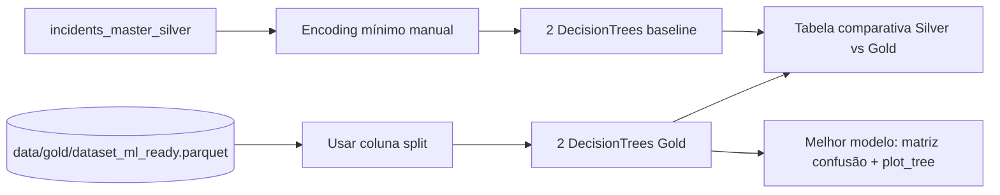

# Plano Técnico — Pessoa 3: Machine Learning + Comparação Silver vs Gold

> **Objetivo:** treinar e comparar modelos de Árvore de Decisão usando duas versões dos
> dados (Silver pura e Gold ML-ready), demonstrando o impacto do pré-processamento na
> performance.

---

## 1. Visão geral



---

## 2. Dados de entrada

| Origem | Arquivo | Responsável | Quando estará pronto |
|--------|---------|-------------|----------------------|
| Silver | `data/silver/incidents_master_silver.parquet` | Já existe | Pronto |
| Gold | `data/gold/dataset_ml_ready.parquet` | Pessoa 2 | Após etapa 2 |

> **Atenção:** o Gold dataset traz uma coluna `split` ∈ {"train", "test"}. **Não refazer
> o split** — usar o mesmo que a Pessoa 2 gerou, para garantir comparabilidade entre os
> modelos Gold treinados aqui e o pipeline da etapa anterior.

---

## 3. Etapa 1 — Baseline na Silver

### 3.1 Justificativa

Demonstrar a performance "antes do pré-processamento sofisticado". DecisionTree é
relativamente robusta a escalas e tolera categóricas via `pd.get_dummies`, então é
possível treinar diretamente na Silver com pouco esforço — mas com nulos e sem
controle de leakage refinado.

### 3.2 Preparação mínima

```python
df_s = pd.read_parquet("data/silver/incidents_master_silver.parquet")

# Selecionar features simples (evitar id/text)
features_baseline = [
    "severity", "attack_vector_primary", "industry_primary",
    "incident_year", "employee_count", "days_to_discovery",
    "has_secondary_vector", "data_loss_unknown", "downtime_unknown",
]
X_s = pd.get_dummies(df_s[features_baseline], drop_first=False)
y_s = df_s["label_severe_incident"]

# Preencher nulos numéricos com mediana (sem fit/transform formal — é baseline)
X_s = X_s.fillna(X_s.median(numeric_only=True))

X_s_train, X_s_test, y_s_train, y_s_test = train_test_split(
    X_s, y_s, test_size=0.20, stratify=y_s, random_state=42
)
```

### 3.3 Modelos baseline

| Modelo | `max_depth` | `criterion` | `min_samples_leaf` |
|--------|-------------|-------------|--------------------|
| Silver-A | 5 | gini | 1 |
| Silver-B | 10 | entropy | 10 |

---

## 4. Etapa 2 — Modelos na Gold

### 4.1 Carregar dataset Gold (já transformado)

```python
df_g = pd.read_parquet("data/gold/dataset_ml_ready.parquet")

train = df_g[df_g["split"] == "train"]
test  = df_g[df_g["split"] == "test"]

X_g_train = train.drop(columns=["label", "split"])
y_g_train = train["label"]
X_g_test  = test.drop(columns=["label", "split"])
y_g_test  = test["label"]
```

### 4.2 Modelos Gold (mesmos hiperparâmetros do baseline para comparação justa)

| Modelo | `max_depth` | `criterion` | `min_samples_leaf` |
|--------|-------------|-------------|--------------------|
| Gold-A | 5 | gini | 1 |
| Gold-B | 10 | entropy | 10 |

> Manter os mesmos hiperparâmetros é essencial: assim a diferença observada vem do
> pré-processamento, não da configuração do modelo.

---

## 5. Avaliação

### 5.1 Métricas (todos os 4 modelos)

```python
from sklearn.metrics import (accuracy_score, precision_score, recall_score,
                             f1_score, confusion_matrix, classification_report)

def evaluate(model, X_test, y_test, name):
    y_pred = model.predict(X_test)
    return {
        "modelo":    name,
        "accuracy":  accuracy_score(y_test, y_pred),
        "precision": precision_score(y_test, y_pred, average="macro", zero_division=0),
        "recall":    recall_score(y_test, y_pred, average="macro", zero_division=0),
        "f1_macro":  f1_score(y_test, y_pred, average="macro", zero_division=0),
    }
```

> **Por que `average="macro"`?** Label desbalanceado (~86% / 14%). Métricas micro/weighted
> mascarariam a performance na classe minoritária (não-severos), justamente a mais
> interessante para detecção.

### 5.2 Visualizações para o melhor modelo Gold

```python
import matplotlib.pyplot as plt
import seaborn as sns
from sklearn.tree import plot_tree

# Matriz de confusão
cm = confusion_matrix(y_g_test, best_model.predict(X_g_test))
sns.heatmap(cm, annot=True, fmt="d", cmap="Blues",
            xticklabels=["Não-severo", "Severo"],
            yticklabels=["Não-severo", "Severo"])
plt.title(f"Matriz de Confusão — {best_name}")

# Árvore (limitada a depth=3 para legibilidade)
fig, ax = plt.subplots(figsize=(20, 10))
plot_tree(best_model, max_depth=3, filled=True,
          feature_names=X_g_train.columns, class_names=["0", "1"],
          ax=ax, fontsize=9)
plt.title(f"Árvore de Decisão (top 3 níveis) — {best_name}")
```

---

## 6. Tabela comparativa Silver vs Gold

| Camada | Modelo | Accuracy | Precision (macro) | Recall (macro) | F1 (macro) |
|--------|--------|----------|--------------------|----------------|------------|
| Silver | Silver-A (d5, gini) | ... | ... | ... | ... |
| Silver | Silver-B (d10, entropy) | ... | ... | ... | ... |
| Gold | Gold-A (d5, gini) | ... | ... | ... | ... |
| Gold | Gold-B (d10, entropy) | ... | ... | ... | ... |

### Discussão obrigatória (markdown)

Responder a estas perguntas no notebook:

1. Qual camada teve melhor F1 macro? Por quê?
2. O pré-processamento melhorou mais a precisão ou o recall da classe minoritária?
3. Algum modelo overfittou? Comparar performance treino vs teste.
4. Quais features apareceram mais alto na árvore Gold? Faz sentido com a EDA da Pessoa 1?
5. Caso o Silver tenha performado parecido ou melhor, discutir hipóteses
   (label muito enviesado, modelo simples demais para captar ganhos de scaling, etc.).

---

## 7. Passo a passo de execução

```
1. Criar notebooks/ml_models.ipynb

2. Célula 1 (code): Setup
   └─ imports: pandas, numpy, sklearn (tree, metrics, model_selection), matplotlib, seaborn, pathlib
   └─ definir paths (PROJECT_ROOT, SILVER_PATH, GOLD_PATH)

--- BLOCO SILVER (pode ser feito ANTES da Pessoa 2 terminar) ---

3. Célula 2 (markdown): "## Baseline — Modelos na Silver"

4. Célula 3 (code): Ler incidents_master_silver.parquet
   └─ selecionar features_baseline (ver seção 3.2)
   └─ pd.get_dummies()
   └─ fillna(median)
   └─ train_test_split(stratify=y, test_size=0.20, random_state=42)

5. Célula 4 (code): Treinar Silver-A (max_depth=5, criterion="gini")
   └─ model.fit(X_s_train, y_s_train)
   └─ evaluate() → guardar resultado

6. Célula 5 (code): Treinar Silver-B (max_depth=10, criterion="entropy", min_samples_leaf=10)
   └─ model.fit(X_s_train, y_s_train)
   └─ evaluate() → guardar resultado

7. Célula 6 (markdown): Breve análise dos baselines Silver

--- BLOCO GOLD (depende de data/gold/dataset_ml_ready.parquet) ---

8. Célula 7 (markdown): "## Modelos na Gold (ML-Ready)"

9. Célula 8 (code): Ler dataset_ml_ready.parquet
   └─ separar por coluna "split" (train/test)
   └─ X_g_train, y_g_train, X_g_test, y_g_test

10. Célula 9 (code): Treinar Gold-A (max_depth=5, criterion="gini")
    └─ mesmos hiperparâmetros que Silver-A

11. Célula 10 (code): Treinar Gold-B (max_depth=10, criterion="entropy", min_samples_leaf=10)
    └─ mesmos hiperparâmetros que Silver-B

--- COMPARAÇÃO ---

12. Célula 11 (code): Montar DataFrame com 4 linhas × 5 métricas
    └─ pd.DataFrame([silver_a, silver_b, gold_a, gold_b])
    └─ print tabela formatada

13. Célula 12 (markdown): Tabela comparativa Silver vs Gold + discussão respondendo
    as 5 perguntas obrigatórias (seção 6)

14. Célula 13 (code): Matriz de confusão do melhor Gold
    └─ sns.heatmap(confusion_matrix(...), annot=True)

15. Célula 14 (code): Visualizar árvore do melhor
    └─ plot_tree(best_model, max_depth=3, filled=True)

16. Célula 15 (code): Salvar reports/ml_results.md programaticamente
    └─ f.write(tabela + discussão em markdown)

17. (Opcional) Célula 16 (code): joblib.dump(best_model, "models/best_decision_tree.joblib")

18. Executar notebook inteiro (Restart & Run All)

19. Commit: "feat(ml): treinar DecisionTrees Silver vs Gold + comparação"
```

---

## 8. Entregáveis

- `notebooks/ml_models.ipynb`.
- `reports/ml_results.md` (tabela final + discussão).
- (Opcional) `models/best_decision_tree.joblib`.

---

## 9. Critérios de aceitação

- [ ] 2 DecisionTrees treinadas na Silver com configs distintas.
- [ ] 2 DecisionTrees treinadas na Gold com configs distintas.
- [ ] Split estratificado justificado (label desbalanceado).
- [ ] Pelo menos 3 métricas reportadas (accuracy, precision, recall, F1 — temos 4).
- [ ] Matriz de confusão visualizada para o melhor modelo.
- [ ] Visualização da árvore (com `max_depth=3` para legibilidade).
- [ ] Comparação Silver vs Gold **explícita** em tabela + discussão textual.
- [ ] Justificativa caso Silver performe igual ou melhor.

---

## 10. Dependências

- **Bloqueado por Pessoa 2** (precisa do `dataset_ml_ready.parquet` para a parte Gold).
- A parte Silver pode ser adiantada em paralelo.
- Resultados desta etapa alimentam o `quality_report_gold.md` da Pessoa 4.

---

## 11. Complexidade

⭐⭐⭐⭐☆ — Combina ML padrão com análise crítica. A interpretação dos resultados
(seção 6 — discussão) é o que diferencia uma entrega medíocre de uma boa.
