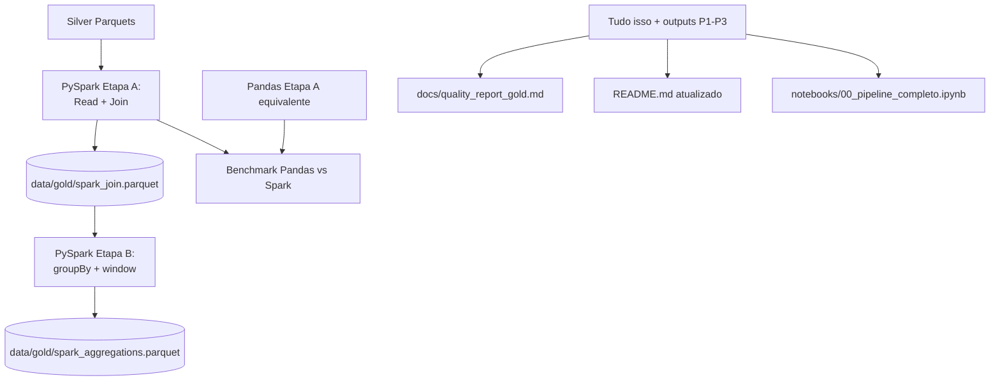
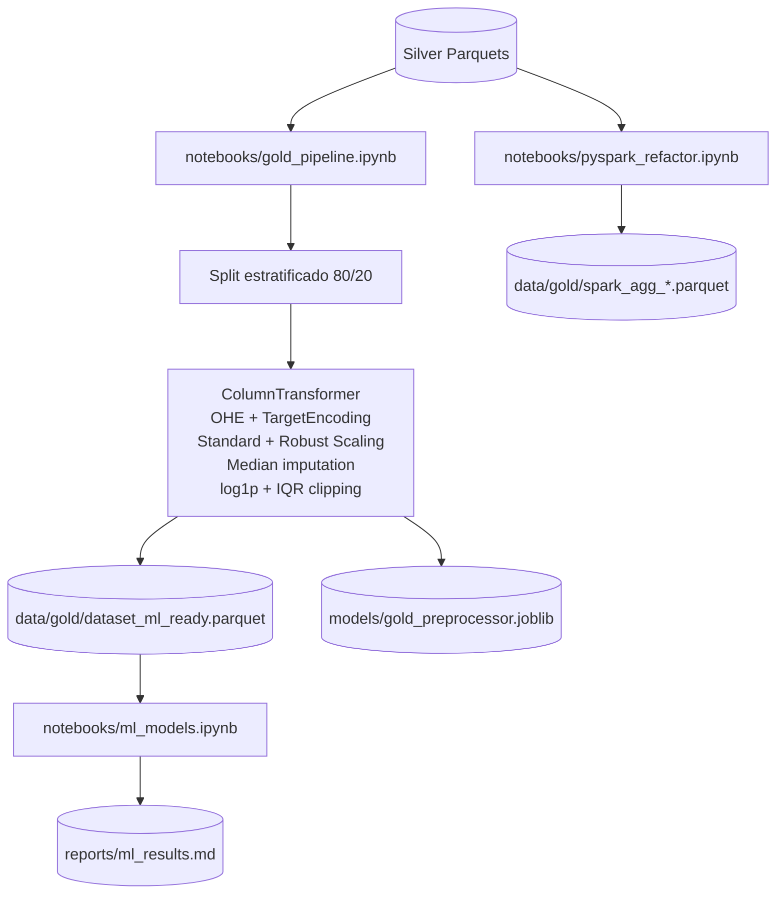

# Plano Técnico — Pessoa 4: PySpark + Governança + Integração Final

> **Objetivo:** demonstrar escalabilidade refatorando etapas para PySpark, atualizar
> a governança (lineage, relatório de qualidade, README) e consolidar o pipeline final.

---

## 1. Visão geral



---

## 2. Etapa 1 — Refatoração em PySpark

Notebook: `notebooks/pyspark_refactor.ipynb`.

### 2.1 Setup Spark local

```python
from pyspark.sql import SparkSession

spark = (SparkSession.builder
         .appName("CyberGoldRefactor")
         .master("local[*]")
         .config("spark.sql.shuffle.partitions", "8")
         .config("spark.driver.memory", "4g")
         .getOrCreate())
```

### 2.2 Etapa A — Leitura + Join Silver → Gold raw

**Equivalente PySpark do join da Pessoa 2** (versão sem encoding/scaling — apenas
join estrutural):

```python
inc  = spark.read.parquet("data/silver/incidents_master_silver.parquet")
fin  = spark.read.parquet("data/silver/financial_impact_silver.parquet")
mkt  = spark.read.parquet("data/silver/market_impact_silver.parquet")

joined = (inc
          .join(fin, on="incident_id", how="left")
          .join(mkt, on="incident_id", how="left"))

joined.write.mode("overwrite").parquet("data/gold/spark_join.parquet")
```

**Requisitos cumpridos**: leitura Parquet ✓, join ✓, escrita Parquet ✓.

### 2.3 Etapa B — Agregações + Window Function

```python
from pyspark.sql import functions as F
from pyspark.sql.window import Window

df = spark.read.parquet("data/gold/spark_join.parquet")

# groupBy com agregação
agg_by_vector = (df.groupBy("attack_vector_primary")
                   .agg(F.count("*").alias("n_incidents"),
                        F.avg("total_loss_usd").alias("avg_loss_usd"),
                        F.expr("percentile_approx(total_loss_usd, 0.5)").alias("median_loss_usd"))
                   .orderBy(F.desc("n_incidents")))

# Window function: ranking de incidentes por ano por perda
w = Window.partitionBy("incident_year").orderBy(F.desc("total_loss_usd"))
ranked = (df.withColumn("rank_loss_year", F.row_number().over(w))
            .filter(F.col("rank_loss_year") <= 5)
            .select("incident_year", "incident_id", "attack_vector_primary",
                    "total_loss_usd", "rank_loss_year"))

agg_by_vector.write.mode("overwrite").parquet("data/gold/spark_agg_by_vector.parquet")
ranked.write.mode("overwrite").parquet("data/gold/spark_top5_per_year.parquet")
```

**Requisitos cumpridos**: groupBy + agg ✓, window function ✓, escrita Parquet ✓.

---

## 3. Etapa 2 — Benchmark Pandas vs PySpark

Comparar a **Etapa A (read + join)** nas duas tecnologias:

```python
import time, pandas as pd

# Pandas
t0 = time.perf_counter()
inc_p = pd.read_parquet("data/silver/incidents_master_silver.parquet")
fin_p = pd.read_parquet("data/silver/financial_impact_silver.parquet")
mkt_p = pd.read_parquet("data/silver/market_impact_silver.parquet")
joined_p = inc_p.merge(fin_p, on="incident_id", how="left").merge(mkt_p, on="incident_id", how="left")
joined_p.to_parquet("data/gold/pandas_join.parquet", index=False)
pandas_time = time.perf_counter() - t0

# Spark (já implementado acima — re-executar medindo)
t0 = time.perf_counter()
# ... mesmo código Spark da Etapa A ...
spark_time = time.perf_counter() - t0

print(f"Pandas: {pandas_time:.2f}s | Spark: {spark_time:.2f}s")
```

### 3.1 Discussão obrigatória no notebook

| Critério | Pandas | PySpark |
|----------|--------|---------|
| Tempo (volume atual ~2k linhas) | ... | ... |
| Overhead de inicialização | ~0s | ~3-5s (JVM) |
| Memória limite | RAM da máquina | Particionável |
| Quando vence | Pequeno (< 1M linhas) | Grande (> 10M, datasets distribuídos) |

> **Resultado esperado:** Pandas vence em volume pequeno devido ao overhead do Spark.
> Discutir que o ganho real do Spark aparece em volumes muito maiores e em ambientes
> distribuídos (Databricks, EMR, etc.).

---

## 4. Etapa 3 — Governança e documentação

### 4.1 Relatório de qualidade Gold — `docs/quality_report_gold.md`

Estrutura:

```markdown
# Relatório de Qualidade — Camadas Prata e Ouro

## 1. Camada Prata (recapitulação)
- Resumo dos shapes finais dos 3 parquets silver.
- Resumo de nulos remanescentes pós-limpeza.
- Link para `docs/silver_decisions.md`.

## 2. Camada Ouro
### 2.1 Dataset ML-ready
- Shape final: linhas × colunas.
- Distribuição do label (train/test).
- Nenhum nulo.
- Schema (lista de colunas + tipo).

### 2.2 Transformações aplicadas
- Tabela completa de `docs/gold_transformations.md` (sintetizada).

### 2.3 Anti-leakage
- Checklist final atualizado: ver `docs/anti_leakage_checklist.md`.
```

Pode ser gerado parcialmente via script (lendo `dataset_ml_ready.parquet` e
extraindo shape/schema), mas o texto interpretativo é manual.

### 4.2 README atualizado

Pontos a alterar:

1. **Título e descrição**: incluir Camada Ouro e ML-Ready.
2. **Mermaid lineage**: estender o diagrama atual com Gold + ML.
3. **Estrutura de pastas**: adicionar `data/gold/`, `models/`, novos notebooks e docs.
4. **Como rodar — pipeline completo**:
   ```bash
   python src/ingestion.py                    # Bronze
   python src/quality.py                      # Validação Bronze
   jupyter nbconvert --execute notebooks/silver_pipeline.ipynb
   jupyter nbconvert --execute notebooks/eda.ipynb
   jupyter nbconvert --execute notebooks/gold_pipeline.ipynb
   jupyter nbconvert --execute notebooks/ml_models.ipynb
   jupyter nbconvert --execute notebooks/pyspark_refactor.ipynb
   ```
5. **Checklist anti-leakage**: incluir as colunas descartadas na Gold.
6. **Dependências**: confirmar que `requirements.txt` cobre tudo.

### 4.3 Lineage estendido (Mermaid)

Adicionar ao diagrama existente:



### 4.4 Notebook consolidado — `notebooks/00_pipeline_completo.ipynb`

**Formato recomendado: índice executável**, não duplicação de código.

Estrutura sugerida:

```markdown
# Pipeline Completo — Cybersecurity Breach Data

## Visão geral
[diagrama mermaid completo]

## Etapa 1 — Bronze
Script: `src/ingestion.py`
[célula com `!python src/ingestion.py`]

## Etapa 2 — Validação
Script: `src/quality.py`
[célula com `!python src/quality.py`]

## Etapa 3 — Silver
Notebook: `notebooks/silver_pipeline.ipynb`
[célula com `%run silver_pipeline.ipynb` ou `nbconvert`]

## Etapa 4 — EDA
[%run eda.ipynb]

## Etapa 5 — Gold
[%run gold_pipeline.ipynb]

## Etapa 6 — Modelagem
[%run ml_models.ipynb]

## Etapa 7 — PySpark
[%run pyspark_refactor.ipynb]

## Resultados finais
[ler reports/ml_results.md, mostrar tabela]
```

### 4.5 `requirements.txt` final

Confirmar (e adicionar se faltar):

```text
pandas==3.0.2
kagglehub==1.0.0
pyspark==4.1.1
pyarrow==23.0.1
numpy==2.4.4
matplotlib==3.10.9
seaborn==0.13.2
scikit-learn==1.5.2
joblib==1.4.2
```

---

## 5. Passo a passo de execução

```
--- FASE A: PySpark (independente — pode começar imediatamente) ---

1. Criar notebooks/pyspark_refactor.ipynb

2. Célula 1 (code): Setup Spark
   └─ SparkSession.builder.appName("CyberGoldRefactor").master("local[*]")
   └─ imports: pyspark.sql.functions, pyspark.sql.window, time, pandas

3. Célula 2 (markdown): "## Etapa A — Leitura e Join Silver"

4. Célula 3 (code): spark.read.parquet dos 3 silver datasets
   └─ join LEFT por incident_id
   └─ joined.write.mode("overwrite").parquet("data/gold/spark_join.parquet")
   └─ print shape resultado

5. Célula 4 (markdown): "## Etapa B — Agregações e Window Function"

6. Célula 5 (code): groupBy("attack_vector_primary").agg(count, avg(total_loss_usd), median)
   └─ .orderBy(desc("n_incidents"))
   └─ write parquet → data/gold/spark_agg_by_vector.parquet

7. Célula 6 (code): Window function
   └─ row_number().over(partition by incident_year order by total_loss_usd desc)
   └─ filtrar top 5 por ano
   └─ write parquet → data/gold/spark_top5_per_year.parquet

8. Célula 7 (markdown): "## Benchmark Pandas vs PySpark"

9. Célula 8 (code): Implementar Etapa A em Pandas puro com time.perf_counter()
   └─ pd.read_parquet + merge + to_parquet
   └─ medir tempo

10. Célula 9 (code): Re-executar Etapa A em Spark com time.perf_counter()
    └─ medir tempo

11. Célula 10 (code): Montar tabela comparativa Pandas vs Spark
    └─ print DataFrame com tempo, overhead, conclusão

12. Célula 11 (markdown): Discussão do benchmark
    └─ explicar overhead JVM
    └─ quando Spark vence (> 10M linhas, clusters)
    └─ conclusão honesta (Pandas vence neste volume)

--- FASE B: Governança (bloqueada por P2 e P3) ---

13. Aguardar P2 finalizar dataset_ml_ready.parquet
    └─ Aguardar P3 finalizar reports/ml_results.md

14. Criar docs/quality_report_gold.md
    └─ Seção 1: recapitulação Silver (shapes, nulos, link p/ silver_decisions.md)
    └─ Seção 2: Gold (shape, schema, distribuição label, zero nulos)
    └─ Seção 3: Transformações (sintetizar gold_transformations.md)
    └─ Seção 4: Anti-leakage final

15. Atualizar README.md
    └─ Estender mermaid com Gold + ML-Ready
    └─ Atualizar árvore de pastas (data/gold/, models/, novos notebooks)
    └─ Adicionar comandos completos de execução
    └─ Atualizar seção de dependências

16. Atualizar requirements.txt
    └─ Adicionar scikit-learn, joblib (versões instaladas)

--- FASE C: Integração Final (por último) ---

17. Criar notebooks/00_pipeline_completo.ipynb
    └─ Markdown narrativo + células !python e %run
    └─ Mermaid lineage completo no topo
    └─ Seções por etapa (Bronze → Silver → EDA → Gold → ML → PySpark)
    └─ Célula final: ler reports/ml_results.md e exibir tabela

18. Smoke-test completo:
    └─ Apagar data/bronze/, data/silver/, data/gold/
    └─ Rodar pipeline do zero seguindo README
    └─ Confirmar que todos os outputs são gerados

19. Commit final: "feat: integração final + README + lineage + quality report Gold"
```

---

## 6. Entregáveis

- `notebooks/pyspark_refactor.ipynb`.
- `notebooks/00_pipeline_completo.ipynb`.
- `data/gold/spark_*.parquet` (3 arquivos: join, agg_by_vector, top5_per_year).
- `docs/quality_report_gold.md`.
- `README.md` atualizado.
- `requirements.txt` atualizado.

---

## 7. Critérios de aceitação

- [ ] 2 etapas refatoradas em PySpark (join + agregação com window).
- [ ] Leitura Parquet, 1 join, 1 groupBy+agg, 1 window function, escrita Parquet — todos presentes.
- [ ] Benchmark Pandas vs Spark executado e discutido com tabela.
- [ ] `docs/quality_report_gold.md` cobre Prata e Ouro.
- [ ] README executa pipeline completo seguindo os passos documentados.
- [ ] Lineage Mermaid cobre Bronze → Silver → Gold → ML-Ready.
- [ ] `requirements.txt` instala em ambiente novo sem erros.

---

## 8. Dependências

- **Etapa 1 (PySpark)**: independente, pode começar logo após Silver (já pronta).
- **Etapa 3 (governança)**: bloqueada por P2 (Gold) e P3 (ML results).
- **Etapa 4 (notebook consolidado e README final)**: tem que ser **a última coisa** do projeto.

---

## 9. Complexidade

⭐⭐⭐⭐☆ — Engenharia + arquitetura. PySpark é o ponto técnico mais novo; governança
é trabalhosa mas direta.
