# Cybersecurity Breach Data Project

Pipeline de engenharia de dados sobre dataset de cibersegurança, organizado em camadas **Bronze** e **Silver**, com a inclusão de uma etapa final de **Análise Exploratória (EDA)**.

---

## 📊 Data Lineage (Arquitetura do Projeto)

Abaixo está o diagrama do fluxo de dados, visualizando todo o percurso desde a origem (Kaggle) até a preparação final para a modelagem de Inteligência Artificial:

```mermaid
graph TD
    %% Origem dos dados
    subgraph Origin [Fonte de Dados]
        Kaggle[(Kaggle Dataset<br/>algozee/cyber-security)]
    end

    %% Camada Bronze
    subgraph Bronze [Camada Bronze - Extração e Padronização Raw]
        Ingestion[src/ingestion.py]
        Extract[Extração via<br/>kagglehub]
        SnakeCase[Padronização de Nomes:<br/>CamelCase/Acentos -> snake_case]
        MetaJSON[Geração de Metadados:<br/>Contagem, Tipos e Hash MD5]
        ParquetBronze[("Bronze Parquet<br/>(Salvo particionado por Data)<br/>+ ingestion_timestamp<br/>+ source_file")]
    end

    %% Camada de Validação
    subgraph Quality [Camada de Qualidade / Observabilidade]
        QualityCheck[src/quality.py]
        Regras["Validações de Regra de Negócio:<br/>1. Nulos (Alerta > 5%, Crítico > 50%)<br/>2. Duplicidade (Exata ou incident_id)<br/>3. Range Temporal (Pós-1990)<br/>4. Coerência Temporal<br/>5. Categorias com Inconsistência<br/>6. Formato de Datas"]
        Report[reports/quality_report.md<br/>reports/quality_report.json]
        ValidatedBronze[("Bronze Validado<br/>+ quality_flag<br/>(*_validated.parquet)")]
    end

    %% Camada Silver
    subgraph Silver [Camada Silver - Preparação para Machine Learning]
        SilverPipe[notebooks/silver_pipeline.ipynb]
        Deduplicacao[Deduplicação:<br/>Manter primeiro 'incident_id']
        DropLeakage["Prevenção de Data Leakage:<br/>Descarte de variáveis futuras<br/>(quality_score, review_flag)<br/>e dados irrelevantes (notas)"]
        PadronizacaoCat[Padronização Categórica:<br/>Lowercase, Trim, Vazios -> None]
        Imputacao["Tratamento de Nulos:<br/>1. Categóricas -> 'unknown'<br/>2. Numéricas -> Mediana + Flag isolada"]
        FilterDates["Limpeza Temporal:<br/>Conversão para Datetime<br/>Remoção: incident_date > discovery_date<br/>Remoção fora de range [1990 - Hoje]"]
        RemoveBronzeFlags[Remoção de Metadados da Bronze:<br/>source_file, quality_flag, ingestion_timestamp]
        ParquetSilver[(Silver Parquet<br/>*_silver.parquet)]
    end

    %% Fluxo de Dados
    Kaggle --> Extract
    Extract --> Ingestion
    Ingestion --> SnakeCase
    SnakeCase --> MetaJSON
    SnakeCase --> ParquetBronze
    
    ParquetBronze -.->|Análise de Qualidade| QualityCheck
    QualityCheck --> Regras
    Regras --> Report
    QualityCheck --> ValidatedBronze
    
    ValidatedBronze --> SilverPipe
    Report --> SilverPipe
    
    SilverPipe --> Deduplicacao
    Deduplicacao --> DropLeakage
    DropLeakage --> PadronizacaoCat
    PadronizacaoCat --> Imputacao
    Imputacao --> FilterDates
    FilterDates --> RemoveBronzeFlags
    RemoveBronzeFlags --> ParquetSilver
    
    %% Estilização
    classDef origin fill:#f9f9f9,stroke:#333,stroke-width:2px;
    classDef bronze fill:#cd7f32,stroke:#333,stroke-width:2px,color:#fff;
    classDef silver fill:#c0c0c0,stroke:#333,stroke-width:2px;
    classDef quality fill:#ffcccc,stroke:#333,stroke-width:2px;

    class Origin origin;
    class Extract,Ingestion,SnakeCase,MetaJSON,ParquetBronze bronze;
    class SilverPipe,Deduplicacao,DropLeakage,PadronizacaoCat,Imputacao,FilterDates,RemoveBronzeFlags,ParquetSilver silver;
    class QualityCheck,Regras,Report,ValidatedBronze quality;
```



---

## 📂 Estrutura de Pastas

```text
cybersecurity-breach-data-project/
├── data/
│   ├── bronze/                    # Dados originais no formato parquet padronizado + metadados
│   └── silver/                    # Dados limpos e preparados para Machine Learning
├── notebooks/
│   ├── silver_pipeline.ipynb      # Notebook final consolidado da Camada Silver
│   └── eda.ipynb                  # Notebook de Análise Exploratória (EDA)
├── reports/
│   ├── quality_report.md          # Relatório de qualidade dos dados da Etapa 2
│   └── quality_report.json        # Relatório de qualidade em formato JSON
├── src/
│   ├── ingestion.py               # Script da Etapa 1 — Extração para Bronze
│   └── quality.py                 # Script da Etapa 2 — Testes de Qualidade
└── requirements.txt               # Dependências do projeto
```

---

## 🚀 Como Rodar o Projeto

**1. Pré-requisitos:** Python 3.10+

**2. Instalação e Ambiente Virtual:**
```bash
# Clone o repositório
git clone <url-do-repositorio>
cd cybersecurity-breach-data-project

# Crie e ative o ambiente virtual
python -m venv venv

# Windows
venv\Scripts\activate

# Linux/macOS
source venv/bin/activate

# Instale as dependências
pip install -r requirements.txt
```

**3. Execução das Etapas:**
- **Etapa 1 (Ingestão Bronze):** Baixa os dados brutos e salva em Parquet.
  ```bash
  python src/ingestion.py
  ```
- **Etapa 2 (Validação de Qualidade):** Verifica anomalias estatísticas e de negócio.
  ```bash
  python src/quality.py
  ```
- **Etapa 3 e 4 (Limpeza e EDA):**
  Abra o VS Code, selecione o interpretador Python (`venv`) e execute os cadernos:
  1. `notebooks/silver_pipeline.ipynb` (Aplica a limpeza baseada nos erros da qualidade)
  2. `notebooks/eda.ipynb` (Gera gráficos e análises visuais)

---

## ⚖️ Checklist Anti-Data Leakage

Para garantir total integridade do modelo de ML e evitar que ele "preveja" situações futuras de maneira errada, excluímos variáveis que seriam preenchidas apenas depois do encerramento do evento. 

O checklist atendido na camada Silver elimina terminantemente:

- [x] **`quality_score` e `quality_grade`:** Eliminadas pois descreviam notas de qualidade pós-análise interna humana. 
- [x] **`confidence_tier` e `review_flag`:** Eliminadas por serem averiguações de curadores avalistas externos após a submissão original do incidente cibernético.
- [x] **`disclosure_date` (crua):** Extirpada e revertida exclusivamente à extração da diferença em dias (para não injetar tendências de datas exatas ao modelo).
- [x] **`created_at` / `updated_at`:** Marcadores puramente do sistema onde o dado estava hospedado na Kaggle. Não servem como traços da anatomia de um ciberataque.
