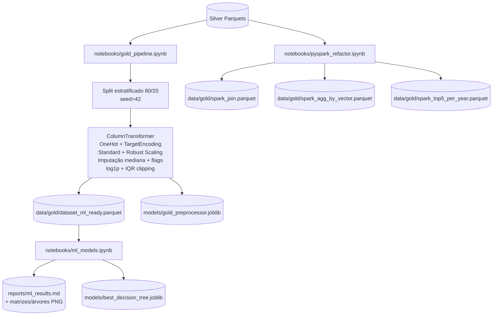

# Cybersecurity Breach Data Project

Pipeline de engenharia de dados (arquitetura **medallion**) sobre o dataset Kaggle `algozee/cyber-security`, cobrindo o fluxo completo **Bronze → Quality → Silver → EDA → Gold (ML-ready) → Machine Learning**, com uma refatoração em **PySpark** para demonstrar escalabilidade. O resultado final é um dataset pronto para ML e modelos de Árvore de Decisão treinados e comparados (Silver vs Gold).

---

## 📊 Data Lineage (Arquitetura do Projeto)

Abaixo está o diagrama do fluxo de dados, visualizando todo o percurso desde a origem (Kaggle) até a preparação final para a modelagem de Inteligência Artificial:


```mermaid
graph TD
    %% Origem dos dados
    subgraph Origin [Fonte de Dados]
        Kaggle[(Kaggle Dataset<br/>algozee/cyber-security)]
    end

    %% Camada Bronze
    subgraph Bronze [Camada Bronze - Extração e Padronização Raw]
        Ingestion[src/ingestion.py]
        Extract[Extração via<br/>kagglehub]
        SnakeCase[Padronização de Nomes:<br/>CamelCase/Acentos -> snake_case]
        MetaJSON[Geração de Metadados:<br/>Contagem, Tipos e Hash MD5]
        ParquetBronze[("Bronze Parquet<br/>(Salvo particionado por Data)<br/>+ ingestion_timestamp<br/>+ source_file")]
    end

    %% Camada de Validação
    subgraph Quality [Camada de Qualidade / Observabilidade]
        QualityCheck[src/quality.py]
        Regras["Validações de Regra de Negócio:<br/>1. Nulos (Alerta > 5%, Crítico > 50%)<br/>2. Duplicidade (Exata ou incident_id)<br/>3. Range Temporal (Pós-1990)<br/>4. Coerência Temporal<br/>5. Categorias com Inconsistência<br/>6. Formato de Datas"]
        Report[reports/quality_report.md<br/>reports/quality_report.json]
        ValidatedBronze[("Bronze Validado<br/>+ quality_flag<br/>(*_validated.parquet)")]
    end

    %% Camada Silver
    subgraph Silver [Camada Silver - Preparação para Machine Learning]
        SilverPipe[notebooks/silver_pipeline.ipynb]
        Deduplicacao[Deduplicação:<br/>Manter primeiro 'incident_id']
        DropLeakage["Prevenção de Data Leakage:<br/>Descarte de variáveis futuras<br/>(quality_score, review_flag)<br/>e dados irrelevantes (notas)"]
        PadronizacaoCat[Padronização Categórica:<br/>Lowercase, Trim, Vazios -> None]
        Imputacao["Tratamento de Nulos:<br/>1. Categóricas -> 'unknown'<br/>2. Numéricas -> Mediana + Flag isolada"]
        FilterDates["Limpeza Temporal:<br/>Conversão para Datetime<br/>Remoção: incident_date > discovery_date<br/>Remoção fora de range [1990 - Hoje]"]
        RemoveBronzeFlags[Remoção de Metadados da Bronze:<br/>source_file, quality_flag, ingestion_timestamp]
        ParquetSilver[(Silver Parquet<br/>*_silver.parquet)]
    end

    %% Fluxo de Dados
    Kaggle --> Extract
    Extract --> Ingestion
    Ingestion --> SnakeCase
    SnakeCase --> MetaJSON
    SnakeCase --> ParquetBronze
    
    ParquetBronze -.->|Análise de Qualidade| QualityCheck
    QualityCheck --> Regras
    Regras --> Report
    QualityCheck --> ValidatedBronze
    
    ValidatedBronze --> SilverPipe
    Report --> SilverPipe
    
    SilverPipe --> Deduplicacao
    Deduplicacao --> DropLeakage
    DropLeakage --> PadronizacaoCat
    PadronizacaoCat --> Imputacao
    Imputacao --> FilterDates
    FilterDates --> RemoveBronzeFlags
    RemoveBronzeFlags --> ParquetSilver
    
    %% Estilização
    classDef origin fill:#f9f9f9,stroke:#333,stroke-width:2px;
    classDef bronze fill:#cd7f32,stroke:#333,stroke-width:2px,color:#fff;
    classDef silver fill:#c0c0c0,stroke:#333,stroke-width:2px;
    classDef quality fill:#ffcccc,stroke:#333,stroke-width:2px;

    class Origin origin;
    class Extract,Ingestion,SnakeCase,MetaJSON,ParquetBronze bronze;
    class SilverPipe,Deduplicacao,DropLeakage,PadronizacaoCat,Imputacao,FilterDates,RemoveBronzeFlags,ParquetSilver silver;
    class QualityCheck,Regras,Report,ValidatedBronze quality;
```

### Camada Ouro + Machine Learning + PySpark

Continuação do fluxo a partir da Silver, até o dataset ML-ready, os modelos e a refatoração distribuída:


```mermaid
graph TD
    Silver[(Silver Parquets)] --> GoldPipe[notebooks/gold_pipeline.ipynb]
    GoldPipe --> SplitStrat[Split estratificado 80/20<br/>seed=42]
    SplitStrat --> Preproc[ColumnTransformer<br/>OneHot + TargetEncoding<br/>Standard + Robust Scaling<br/>Imputação mediana + flags<br/>log1p + IQR clipping]
    Preproc --> GoldDS[(data/gold/dataset_ml_ready.parquet)]
    Preproc --> Joblib[(models/gold_preprocessor.joblib)]
    GoldDS --> MLNB[notebooks/ml_models.ipynb]
    MLNB --> Results[(reports/ml_results.md<br/>+ matrizes/árvores PNG)]
    MLNB --> BestModel[(models/best_decision_tree.joblib)]

    Silver --> SparkNB[notebooks/pyspark_refactor.ipynb]
    SparkNB --> SparkJoin[(data/gold/spark_join.parquet)]
    SparkNB --> SparkAgg[(data/gold/spark_agg_by_vector.parquet)]
    SparkNB --> SparkTop5[(data/gold/spark_top5_per_year.parquet)]
```

> **Alvo de ML:** a EDA explora `label_severe_incident`; a Gold/ML usam o alvo de *dwell time*
> (binário pela mediana de `days_to_discovery`, gravado como coluna `label`, ~51/49 balanceado).

---

## 📂 Estrutura de Pastas

> **Nota:** `data/`, `reports/`, `docs/` e `models/` são **gitignored** — são saídas locais
> reconstruídas ao rodar o pipeline, não versionadas.

```text
cybersecurity-breach-data-project/
├── data/
│   ├── bronze/                    # Parquet padronizado + metadata.json (particionado por data)
│   ├── silver/                    # 3 datasets limpos, independentes (incidents/financial/market)
│   └── gold/                      # dataset_ml_ready.parquet, market_retroactive + saídas PySpark
├── notebooks/
│   ├── silver_pipeline.ipynb      # Etapa 3 — Camada Silver (limpeza, anti-leakage)
│   ├── eda.ipynb                  # Etapa 4 — Análise Exploratória orientada a hipóteses
│   ├── gold_pipeline.ipynb        # Etapa 5 — Join + pré-processamento ML-ready (sklearn)
│   ├── ml_models.ipynb            # Etapa 6 — DecisionTrees Silver vs Gold + comparação
│   ├── pyspark_refactor.ipynb     # Etapa 7 — Refatoração PySpark + benchmark vs Pandas
│   └── 00_pipeline_completo.ipynb # Índice executável de todo o pipeline (ponta a ponta)
├── src/
│   ├── ingestion.py               # Etapa 1 — Extração/padronização para Bronze
│   └── quality.py                 # Etapa 2 — Validação de qualidade dirigida por regras
├── reports/
│   ├── quality_report.{md,json}   # Relatório de qualidade da Etapa 2
│   ├── ml_results.md              # Tabela comparativa + discussão dos modelos (Etapa 6)
│   └── *.png                      # Matriz de confusão e árvore de decisão
├── docs/
│   ├── silver_decisions.md        # Decisões por coluna na Silver
│   ├── gold_transformations.md    # Tabela de transformações da Gold
│   ├── anti_leakage_checklist.md  # Checklist anti-leakage
│   └── quality_report_gold.md     # Relatório de qualidade consolidado Prata + Ouro
├── models/                        # gold_preprocessor.joblib, best_decision_tree.joblib
└── requirements.txt               # Dependências do projeto
```

---

## 🚀 Como Rodar o Projeto

**1. Pré-requisitos:**
- **Python 3.10+** (testado em 3.13).
- **JDK 17 ou 21** apenas para a etapa PySpark (`notebooks/pyspark_refactor.ipynb`). O Spark 4.x **não** suporta Java 23+. Defina `JAVA_HOME` apontando para o JDK.
- **Windows + PySpark:** baixe `winutils.exe` + `hadoop.dll` (Hadoop 3.x), coloque em `C:\hadoop\bin` e defina `HADOOP_HOME=C:\hadoop` (+ no `PATH`). Sem isso o Spark falha ao gravar Parquet.

**2. Instalação e Ambiente Virtual:**
```bash
# Clone o repositório
git clone <url-do-repositorio>
cd cybersecurity-breach-data-project

# Crie e ative o ambiente virtual
python -m venv venv

# Windows
venv\Scripts\activate

# Linux/macOS
source venv/bin/activate

# Instale as dependências
pip install -r requirements.txt
```

**3. Execução do pipeline completo (ponta a ponta):**

Os scripts `src/*.py` rodam direto; os notebooks podem ser executados no VS Code (interpretador =
`venv`, *Restart & Run All*) **ou** headless via `jupyter nbconvert`. Ordem obrigatória:

```bash
# Etapas 1–2 (scripts) — Bronze e Validação de Qualidade
python src/ingestion.py
python src/quality.py

# Etapas 3–7 (notebooks) — Silver → EDA → Gold → ML → PySpark
jupyter nbconvert --to notebook --execute --inplace notebooks/silver_pipeline.ipynb
jupyter nbconvert --to notebook --execute --inplace notebooks/eda.ipynb
jupyter nbconvert --to notebook --execute --inplace notebooks/gold_pipeline.ipynb
jupyter nbconvert --to notebook --execute --inplace notebooks/ml_models.ipynb
jupyter nbconvert --to notebook --execute --inplace notebooks/pyspark_refactor.ipynb
```

> Alternativa: abra `notebooks/00_pipeline_completo.ipynb`, que orquestra todas as etapas em ordem.

| Etapa | Artefato | Saída principal |
|-------|----------|-----------------|
| 1 — Bronze | `src/ingestion.py` | `data/bronze/<data>/*.parquet` + `metadata.json` |
| 2 — Quality | `src/quality.py` | `reports/quality_report.*` + `*_validated.parquet` |
| 3 — Silver | `silver_pipeline.ipynb` | `data/silver/*_silver.parquet` |
| 4 — EDA | `eda.ipynb` | gráficos + hipóteses |
| 5 — Gold | `gold_pipeline.ipynb` | `data/gold/dataset_ml_ready.parquet` + `models/gold_preprocessor.joblib` |
| 6 — ML | `ml_models.ipynb` | `reports/ml_results.md` + `models/best_decision_tree.joblib` |
| 7 — PySpark | `pyspark_refactor.ipynb` | `data/gold/spark_*.parquet` + benchmark |

---

## ⚖️ Checklist Anti-Data Leakage

Para garantir total integridade do modelo de ML e evitar que ele "preveja" situações futuras de maneira errada, excluímos variáveis que seriam preenchidas apenas depois do encerramento do evento. 

O checklist atendido na camada Silver elimina terminantemente:

- [x] **`quality_score` e `quality_grade`:** Eliminadas pois descreviam notas de qualidade pós-análise interna humana. 
- [x] **`confidence_tier` e `review_flag`:** Eliminadas por serem averiguações de curadores avalistas externos após a submissão original do incidente cibernético.
- [x] **`disclosure_date` (crua):** Extirpada e revertida exclusivamente à extração da diferença em dias (para não injetar tendências de datas exatas ao modelo).
- [x] **`created_at` / `updated_at`:** Marcadores puramente do sistema onde o dado estava hospedado na Kaggle. Não servem como traços da anatomia de um ciberataque.

E na **camada Gold**, antes do `fit`, removemos também:

- [x] **Identificadores:** `incident_id`, `stock_ticker` (e a duplicata `stock_ticker_mkt` gerada no join).
- [x] **Datas cruas:** `incident_date`, `discovery_date`, `incident_month`, `incident_day` — já resumidas em `days_to_discovery` / `days_to_disclosure`.
- [x] **Variáveis pós-evento do mercado:** `price_1d_after`, `price_7d_after`, `price_30d_after`, `abnormal_return_*`, `car_*`, `post_incident_volatility_30d`, `days_to_price_recovery` — não observáveis antes do evento (leakage em tempo real). Preservadas à parte em `data/gold/market_retroactive.parquet` para análise retroativa.

> Detalhamento completo em `docs/anti_leakage_checklist.md` e `docs/quality_report_gold.md`.
